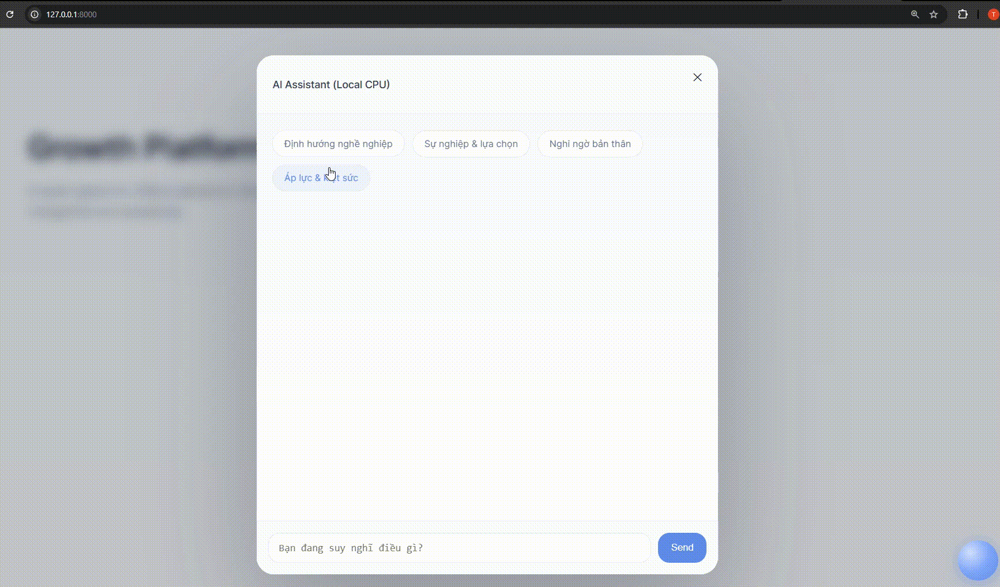

## COMING SOON ...

This project is currently under active development.

Stay tuned.

### Key Features:

* Training via parameter-efficient fine-tuning LLMs
* CPU-friendly inference (no GPU required)

### Demo
- `Version 1.0 (14/01/2026)`

